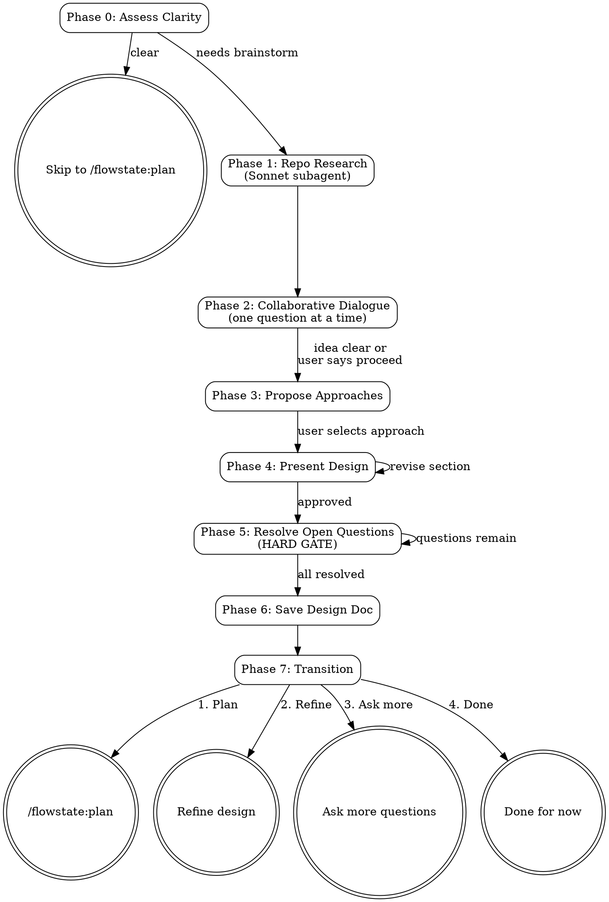

# Brainstorming Ideas Into Designs

Turn rough ideas into validated designs through guided dialogue. Prevent premature implementation.

<HARD-GATE>
Do NOT invoke any implementation skill, write any code, scaffold any project,
or take any implementation action until you have presented a design and the
user has approved it. This applies to EVERY project regardless of perceived
simplicity.
</HARD-GATE>

## Anti-Pattern: "This Is Too Simple To Need A Design"

Every project goes through this process. A todo list, a single-function utility, a config
change — all of them. "Simple" projects are where unexamined assumptions cause the most
wasted work. The design can be short (a few sentences for truly simple projects), but you
MUST present it and get approval before any implementation begins.

## Checklist

Create a task for each item and complete them in order:

1. **Assess clarity** — decide if brainstorming is needed or requirements are already clear
2. **Repo research** — scan codebase for patterns, similar implementations, conventions
3. **Collaborative dialogue** — ask questions one at a time to refine the idea
4. **Propose approaches** — present 2-3 options with trade-offs and a recommendation
5. **Present design** — section by section, scaled to complexity, with approval gates
6. **Resolve open questions** — every open question must be answered before proceeding
7. **Save design doc** — write to `docs/brainstorms/YYYY-MM-DD-<topic>-brainstorm.md` and commit
8. **Transition** — offer next steps via structured choices

## Process Flow



## The Process

### Phase 0: Assess Requirement Clarity

Before asking questions, assess whether full brainstorming is needed.

**Requirements are already clear when:**
- User provided specific acceptance criteria
- User referenced existing patterns to follow
- User described exact expected behavior
- Scope is constrained and well-defined

**Brainstorming is needed when:**
- User used vague terms ("make it better", "add something like")
- Multiple reasonable interpretations exist
- Trade-offs have not been discussed
- User seems unsure about the approach

If requirements are clear, offer: "Your requirements are detailed enough to skip brainstorming.
Shall I proceed directly to `/flowstate:plan`?" This is a skip gate — user must explicitly
confirm before skipping.

### Phase 1: Lightweight Repo Research

Before asking the user any questions, run a quick codebase scan to inform the dialogue.
Spawn a **Sonnet subagent** (repo-research-analyst) to find:

- Existing patterns related to the feature
- Similar implementations in the codebase
- CLAUDE.md guidance and conventions
- Relevant files and directory structure

This research shapes what questions to ask and what options to propose. Do not ask the user
questions you could answer by reading the codebase.

### Phase 2: Collaborative Dialogue

Ask questions **one at a time** using the AskUserQuestion tool.

**Question techniques:**

1. **Prefer multiple choice when natural options exist**
   - Good: "Should the notification be: (a) email only, (b) in-app only, or (c) both?"
   - Avoid: "How should users be notified?"

2. **Start broad, then narrow**
   - First: What is the core purpose? Who are the users?
   - Then: What constraints exist? What does success look like?
   - Finally: Edge cases, error handling, specific behaviors

3. **Validate assumptions explicitly**
   - "I'm assuming users will be authenticated. Is that correct?"

4. **Ask about success criteria**
   - "How will you know this feature is working well?"

**Key topics to explore:**

| Topic | Example Questions |
|-------|-------------------|
| Purpose | What problem does this solve? What is the motivation? |
| Users | Who uses this? What is their context? |
| Constraints | Technical limitations? Timeline? Dependencies? |
| Success | How will you measure success? What is the happy path? |
| Edge Cases | What should not happen? Error states to consider? |
| Existing Patterns | Similar features in the codebase to follow? |

**Exit condition:** Continue until the idea is clear OR user says "proceed" or "let's move on."

Track any unresolved questions in an **Open Questions** list as they arise.

### Phase 3: Propose Approaches

Present 2-3 different approaches with trade-offs. Lead with your recommended option
and explain why.

**Structure for each approach:**

```markdown
### Approach A: [Name] (Recommended)

[2-3 sentence description]

**Pros:**
- [Benefit 1]
- [Benefit 2]

**Cons:**
- [Drawback 1]

**Best when:** [Circumstances where this approach shines]
```

**Guidelines:**
- Be honest about trade-offs
- Apply YAGNI — simpler is usually better
- Reference codebase patterns discovered in Phase 1
- Get user selection before proceeding

### Phase 4: Present Design

Present the design section by section, scaled to complexity:
- A few sentences if straightforward
- Up to 200-300 words per section if nuanced

**Sections to cover** (as applicable):
- Architecture and components
- Data flow
- Error handling
- Testing approach

After each section, ask: "Does this look right so far?"

Be ready to revise sections based on feedback. Do not move forward until the user
approves the current section.

### Phase 5: Resolve Open Questions (HARD GATE)

Before proceeding to save, review ALL Open Questions captured during dialogue.

**Every open question must be resolved** via AskUserQuestion. Move each resolved
question to a "Resolved Questions" section with its answer.

Do NOT proceed to Phase 6 with any unresolved questions. This is a hard gate.

### Phase 6: Save Design Doc

Write the validated design to: `docs/brainstorms/YYYY-MM-DD-<topic>-brainstorm.md`

Use the output template below. Before saving, invoke the **flowstate:document-review** skill for a structured self-review of the brainstorm document. Address any critical or important issues found before committing.

Commit to git.

### Phase 7: Transition

Offer options via AskUserQuestion:

1. **Proceed to planning** — invoke `/flowstate:plan` (auto-detects brainstorm doc)
2. **Review and refine** — improve the design document
3. **Ask more questions** — return to Phase 2
4. **Done for now** — save and return later

## Output Template

```markdown
---
date: YYYY-MM-DD
topic: <kebab-case-topic>
status: active
origin: brainstorming session
---

# <Topic Title>

## What We're Building
[Concise description — 1-2 paragraphs max]

## Why This Approach
[Approaches considered and why this one was chosen]

## Key Decisions
- [Decision 1]: [Rationale]
- [Decision 2]: [Rationale]

## Open Questions
- [Any questions still unresolved — should be empty after Phase 5]

## Resolved Questions
- [Question]: [Resolution]

## Next Steps
> `/flowstate:plan` for implementation details
```

## YAGNI Principles

During brainstorming, actively resist complexity:

- Do not design for hypothetical future requirements
- Choose the simplest approach that solves the stated problem
- Prefer boring, proven patterns over clever solutions
- Ask "Do we really need this?" when complexity emerges
- Defer decisions that do not need to be made now

## Key Principles

- **One question at a time** — do not overwhelm with multiple questions
- **Multiple choice preferred** — easier to answer than open-ended
- **Research before asking** — read the codebase so you ask informed questions
- **Explore alternatives** — always propose 2-3 approaches before settling
- **Incremental validation** — present design, get approval, then move on
- **Resolve everything** — no open questions survive to the planning phase
- **WHAT not HOW** — brainstorming decides what to build; planning decides how

## Anti-Patterns to Avoid

| Anti-Pattern | Better Approach |
|--------------|-----------------|
| Asking 5 questions at once | Ask one at a time via AskUserQuestion |
| Jumping to implementation details | Stay focused on WHAT, not HOW |
| Proposing overly complex solutions | Start simple, add complexity only if needed |
| Ignoring existing codebase patterns | Run repo research first (Phase 1) |
| Making assumptions without validating | State assumptions explicitly and confirm |
| Creating lengthy design documents | Keep it concise — details go in the plan |
| Skipping open question resolution | Every question must be resolved (Phase 5) |
